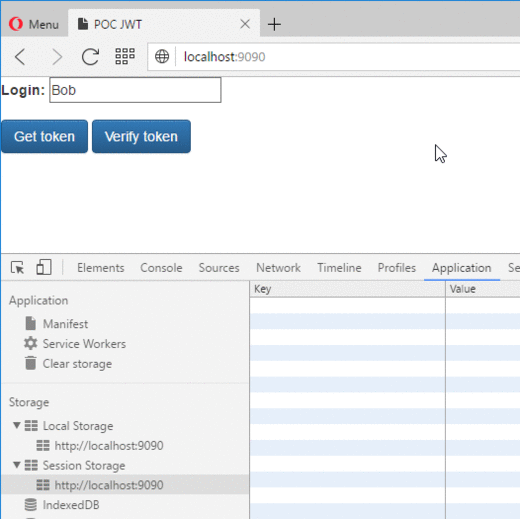

# Introduction

It's the code repository of the OWASP cheatsheet [JSON Web Token (JWT) Cheat Sheet for Java](https://www.owasp.org/index.php/JSON_Web_Token_(JWT)_Cheat_Sheet_for_Java).
 
A web page propose the creation and the validation of the token, see animated GIF image below:



All classes are full documented.

The project was developed with JAX-RS + Maven under IntelliJ IDEA.

# Build status

[](https://travis-ci.org/righettod/poc-jwt)
 
# Build or Run

Run the following command to create a WAR archive:
```
mvn clean package
```

Run the following command to run the prototype:
```
mvn tomcat7:run-war
```
